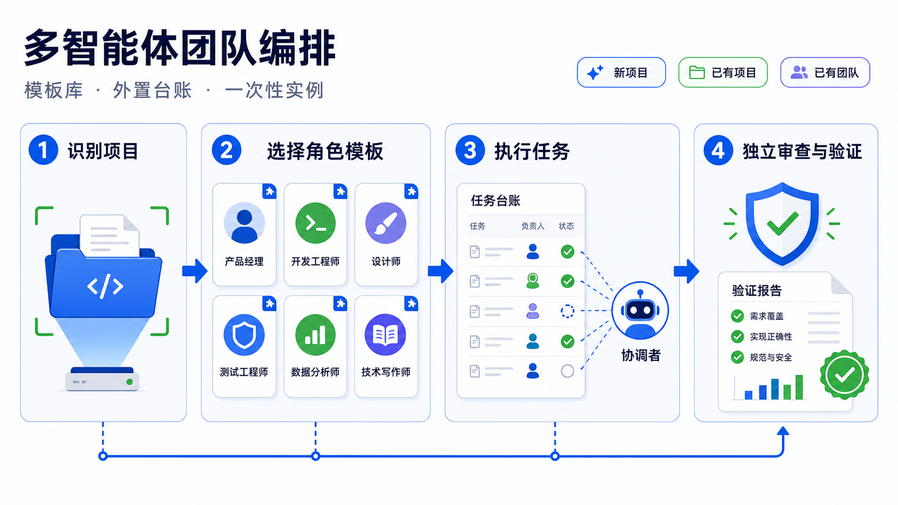
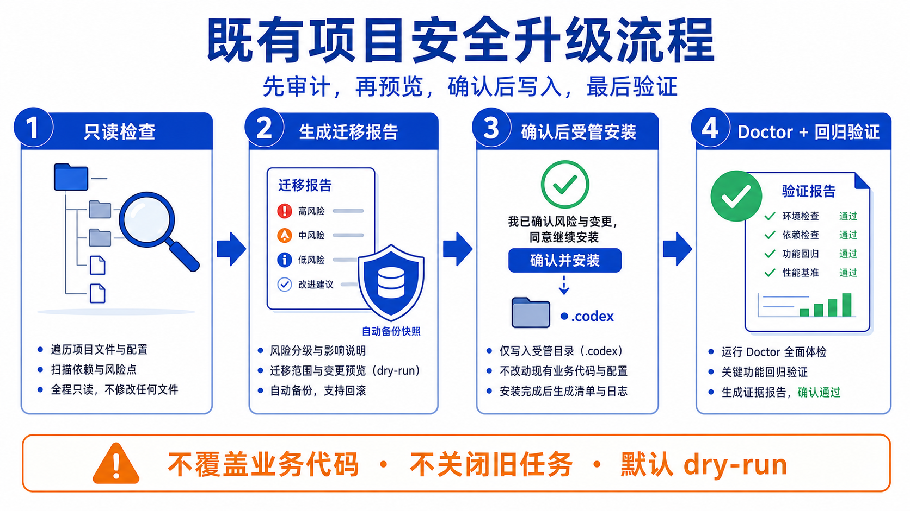

# Multi-Agent Team Skill v2.0.4

<div align="center">
  <strong>control-plane-only · fast lane · project lane · deterministic migration</strong><br>
  为新项目初始化协作层，为已有项目非侵入安装，为旧团队确定升级。
</div>

<p align="center">
  <a href="./README.md">简体中文</a> · <a href="./docs/README_zh-tw.md">繁體中文</a> · <a href="./docs/README_en.md">English</a>
</p>

<p align="center">
  
</p>

<p align="center">
  <a href="./LICENSE"></a>
  <a href="./CHANGELOG.md"></a>
  <a href="./scripts/"></a>
</p>

## v2 的核心变化

### 主控任务自动命名与非阻塞派发

inspect-first 按 README 第一处有效 H1、可读项目 manifest、目录 basename 确定显示名，并输出 `TITLE_SUGGESTED=主控｜<项目显示名>` 与 `RENAME_ACTION=codex_app__set_thread_title(...)`。主控必须调用 Codex 客户端完成重命名；Python 不伪造客户端成功。客户端不支持时安装不失败，但明确 `TITLE_RENAME=pending`；最新版仅做健康检查也执行同一动作。

主任务不再承担生产代码实现。它默认是唯一 `control-plane-only` 控制面，只负责：

- 只读识别项目状态与风险；
- 拆分、排队、派发、监控、验收和汇报；
- 写入 `.codex/team/` 与 `docs/协作/` 中的受管调度状态；
- 在外部发布、生产写入和凭据变更前取得独立批准。

普通执行进入 fast lane，复杂持续工作进入 project lane。planner 不再返回“主任务直接实现”。

2.0.4 对这条边界增加失败关闭：安装、升级、审计和 doctor 会检查 `AGENTS.md` 受管块之外是否仍有“快速直改”“聚焦开发”“主任务自行实现”等冲突规则；存在冲突时不再以 marker 存在为由假通过。任务包同时禁止把写入目标切换到 inspect 根目录之外的另一 checkout/worktree。

派发遵循 `dispatch-and-return`：成功 spawn 一个或一批 Agent 后，先批量完成 spawn，再一次性回传任务编号、角色、状态并结束当前 turn。同一派发 turn 禁止 `wait_agent`、重复状态轮询、长测试或继续集成；完成通知、health、验收和重派延后到用户 turn、完成事件 turn 或自动唤醒。用户新消息优先由新的调度轮处理，依赖队列和路径所有权避免后台冲突。同步等待必须由用户明确要求且先告知会阻塞输入。



## 用户不需要知道内部术语

用户可以直接说：

```text
multi-agent-team-skill 帮我初始化这个项目
multi-agent-team-skill 帮我升级这个项目
multi-agent-team-skill 帮我检查这个项目
```

Skill 首先只读执行：

```bash
python3 scripts/inspect_team.py --project <项目根目录>
```

| 自动识别 | 默认动作 |
|---|---|
| `new` | dry-run 初始化协作层 |
| `existing-project` | 非侵入 dry-run，保留业务代码、配置和文档 |
| `existing-team:v1` | 确定性迁移到 schema 2.0 / Skill 2.0.4 |
| `existing-team:v2-upgrade` | 事务升级受管规则、状态字段和模板 |
| `existing-team:v2` | doctor + runtime health |
| `existing-team:audit` | 未知或自定义团队只读审计，失败关闭 |

## 双通道

| 通道 | 适用任务 | 生命周期 | 派发包 | Review |
|---|---|---|---|---|
| fast lane | 普通、短时、边界明确任务 | 一次性 Agent，完成释放 | 轻任务最小包，其余完整包 | 轻任务默认 on-failure |
| project lane | 跨日、多任务包、独立领域、持续维护 | 创建或复用长期领域任务 | 完整任务包与 handoff | 高风险始终 fresh reviewer |

层级固定：

```text
主任务（control-plane-only）
├── fast lane 一次性 Agent
└── project lane 长期领域任务
    └── 一次性 Agent
```

禁止更深嵌套；长期任务不得创建更多长期任务。
这里的 registry `depth=2` 是“主控制面代长期任务派发一次性 Agent”的受管任务关系，不是 Codex Agent 递归创建层级；项目配置固定 `[agents].max_depth=1`，不得改成 2。

## 队列与并发

- 队列数量不限，任务不会因为活跃任务已满而丢失。
- 总运行并发默认 `6`，其中写实例最多 `2`。
- 依赖未完成、路径冲突、写槽位不足或总容量不足时保持 `queued`。
- 同一活跃 project `domain_key` 只允许一个长期任务。
- 路径所有权支持祖先/子路径冲突检测。
- registry 使用进程锁、revision CAS、幂等登记和原子写入。

## 模型路由与失败升级

| 档位 | 默认模型 | 典型工作 |
|---|---|---|
| fast | `gpt-5.6-luna` | 探索、轻量文档、机械任务 |
| standard | `gpt-5.6-terra` | 常规实现、调试、测试 |
| advanced | `gpt-5.6-sol` | 架构、安全、迁移、高风险 reviewer |

运行中的实例不能换脑。同一异常指纹连续失败两次后：

1. 保存摘要、diff、测试和 handoff 路径；
2. 将旧实例置为 `escalation_required` 并释放运行槽位；
3. 用 `replace` 创建更高档模型的新实例；
4. 记录 `replaces_instance_id`、generation 与恢复证据。

Sol 仍同因失败两次时停止并阻塞，不伪造成功。

## 轻任务与审查

轻任务需同时满足低风险、预计不超过半天、单任务包、无独立发布和长期决策保留。它使用 [最小派发包模板](./templates/project/docs/最小派发包.template.md)，失败或风险上升时转 [完整任务包](./templates/project/docs/任务包.template.md)。

以下情况始终使用全新只读 reviewer：

- `high` / `critical` 风险；
- 安全、迁移、架构或外部副作用；
- 完整回归无法覆盖的高风险合并。

reviewer 只接收验收标准、最终 diff、测试输出和必要边界，不继承实现过程。

## 初始化、升级与检查

```bash
# 1. inspect-first，只读
python3 scripts/inspect_team.py --project <path>

# 2. new / existing-project：默认 dry-run
python3 scripts/team_init.py --project <path> --profile auto
python3 scripts/team_init.py --project <path> --profile auto --apply

# 3. existing-team:v1 / v2-upgrade：默认 dry-run
python3 scripts/team_upgrade.py --project <path>
python3 scripts/team_upgrade.py --project <path> --apply

# 用户明确要求时，为已有 v2 团队开启 project lane 受控自动派发
python3 scripts/team_upgrade.py --project <path> --thread-mode controlled-auto --apply

# 4. 未知团队只读审计
python3 scripts/team_audit.py --project <path>

# 5. 安装与运行态检查
python3 scripts/team_doctor.py --project <path>
python3 scripts/thread_orchestrator.py health --project <path>

# 6. 仅用真实客户端输出推进冒烟状态；默认 dry-run
python3 scripts/runtime_smoke.py --project <path> \
  --explorer-evidence artifacts/explorer-smoke.log
python3 scripts/runtime_smoke.py --project <path> \
  --explorer-evidence artifacts/explorer-smoke.log --apply
python3 scripts/runtime_smoke.py --project <path> \
  --reviewer-evidence artifacts/reviewer-smoke.log --apply

# 7. 客户端真实重命名和置顶成功后，持久化当前主控；默认 dry-run
python3 scripts/bind_control_task.py --project <path> \
  --thread-id <codex-thread-id> --host-id local --pinned
python3 scripts/bind_control_task.py --project <path> \
  --thread-id <codex-thread-id> --host-id local --pinned --apply

# 8. 只有主控绑定和双角色 runtime smoke 都完成才通过完整完成闸
python3 scripts/team_doctor.py --project <path> --strict
```

`team_init.py` 与 `team_upgrade.py` 仅在 `--apply` 时写入；已有项目只修改受管协作文件并先备份。v2 的 `--thread-mode` 会同步 manifest 与 project-state，但不会放宽外部动作审批。模型档位变更遇到活动或可恢复实例时输出 `replacement_required` 并保持实例、模型和模板不变，只允许无活动实例或终态记录安全重配置。未知 schema、自定义角色漂移、符号链接逃逸、Git ignored 受管路径和冲突配置均失败关闭。
`runtime_smoke.py` 只接受项目内已存在、非空、非 symlink 的证据：单侧 explorer/reviewer 证据为 `partial_done`，两侧证据齐全才是 `runtime_validation_done`；无法运行真实客户端时保持 `pending`，不得创建占位日志。`bind_control_task.py` 只在调用方确认客户端重命名和置顶成功后记录真实线程；缺少绑定、置顶或双角色证据时 `team_doctor.py --strict` 必须失败。



## 编排命令

任务输入字段见 [运行时编排契约](./references/runtime-orchestration.md)，可运行样例见 [task-input.example.json](./examples/task-input.example.json)。

```bash
# 规划：只读，返回 fast/project lane、模型、派发包和 review 策略
python3 scripts/thread_orchestrator.py plan --project <path> --task-json task.json

# 入队：默认 dry-run；队列不限
python3 scripts/thread_orchestrator.py enqueue --project <path> \
  --task-json task.json --task-id TASK-001
python3 scripts/thread_orchestrator.py enqueue --project <path> \
  --task-json task.json --task-id TASK-001 --apply

# 绑定客户端创建后返回的实例 ID
python3 scripts/thread_orchestrator.py dispatch --project <path> \
  --task-id TASK-001 --instance-id <client-instance-id> --apply

# 心跳或完成
python3 scripts/thread_orchestrator.py update --project <path> \
  --thread-id TASK-001 --stage verified --summary '验证完成' \
  --evidence artifacts/test.log --status completed --apply

# 同因失败与新实例升级
python3 scripts/thread_orchestrator.py fail --project <path> \
  --task-id TASK-001 --fingerprint build-timeout --handoff artifacts/handoff.md --apply
python3 scripts/thread_orchestrator.py replace --project <path> \
  --task-id TASK-001 --new-instance-id <new-id> --new-model <required-model> \
  --handoff artifacts/handoff.md --apply
```

## 受管状态

| 文件 | 作用 |
|---|---|
| `.codex/team/project-state.json` | 控制面、并发、lane、模型、超时、Token 与 `interaction_policy` 策略 |
| `.codex/team/thread-registry.json` | 排队与运行任务真源，含依赖、实例、层级和 handoff |
| `.codex/team/ownership-locks.json` | 活跃写路径派生锁 |
| `.codex/team/budget-state.json` | 项目与任务 Token 派生状态 |
| `.codex/team/recovery-journal.json` | 注册、失败、替换、reconcile 事件 |
| `docs/协作/状态快照.json` | 与 registry 同步的人读快照 |

Token 门禁：70% 压缩上下文，85% 冻结范围，100% 保存现场并停止。

## 模板与资产边界

- `templates/` 是可部署模板唯一真源。
- `assets/` 只保存静态展示图片及 image_gen provenance。
- 模板业务中性，不含客户名、业务项目名、本机绝对路径或凭据。
- 目标项目产物只写受管协作路径；Skill 维护不修改目标业务源码。

详见 [Templates 说明](./templates/README.md) 与 [Assets 说明](./assets/README.md)。

## 验证

```bash
python3 scripts/health_check.py --deep
PYTHONOPTIMIZE=1 python3 scripts/regression_check.py
python3 scripts/check_readme_links.py
bash scripts/verify_assets.sh
```

深度验证覆盖 inspect、init、upgrade、doctor、health、orchestrator、新环境、已有环境、运行时故障、`PYTHONOPTIMIZE=1`、README 本地链接和视觉资产引用。官方 validator 若存在，再运行其 `quick_validate.py`。

真实回归输出见 [2.0.4 验证证据](./examples/regression-evidence-2026-07-19-v2.0.4.md)，评分口径见 [生产评分卡](./governance/PRODUCTION-SCORECARD.md)。

## 安全边界

- 默认 dry-run；未知或自定义团队先审计。
- 不覆盖业务源码、构建工具、技术栈或目录结构。
- 不伪造客户端任务 ID、运行态冒烟、测试结果或 reviewer 结论。
- Python 只能校验和输出 dispatch-return 契约，无法控制客户端 turn 结束，禁止伪造真实 UI 并发证明。
- 发布、生产写入、付费动作和凭据变更必须独立明确批准。
- 不提交、不推送是调用方边界；脚本自身不会执行 Git 发布动作。

## 文档导航

- [SKILL.md](./SKILL.md)
- [START-HERE.md](./START-HERE.md)
- [References 索引](./references/INDEX.md)
- [迁移规则](./references/schema-migration.md)
- [完成闸](./references/completion-gate.md)
- [CHANGELOG](./CHANGELOG.md)
- [Security](./SECURITY.md)

作者：`xyqierkang@gmail.com` · [GitHub](https://github.com/qierkang)


## Goal 隔离与项目主控

主控任务、主控线程、项目主控和“当前对话设为项目主控”都是普通 Codex 对话控制面，绝不等价于 Goal。初始化或升级措辞即 dry-run 无冲突后 apply 的授权，无冲突时无需二次确认；项目主控默认 `controlled-auto`。除非用户明确说创建 Goal、使用目标模式或设置目标预算，否则不调用 Goal、goal-writer 或 `/goal`。

若当前线程已有 Goal，报告 `GOAL_MODE=unsupported_for_control_plane_setup`，建议在普通新线程执行；不复用、新建、完成或删除已有 Goal。project task/长期领域任务是本 Skill 的受管协作任务，不是 Codex Goal。静态 Skill 无法从代码层绝对阻止客户端违反指令，只能通过 AGENTS/Skill 硬约束和审查降低风险。
