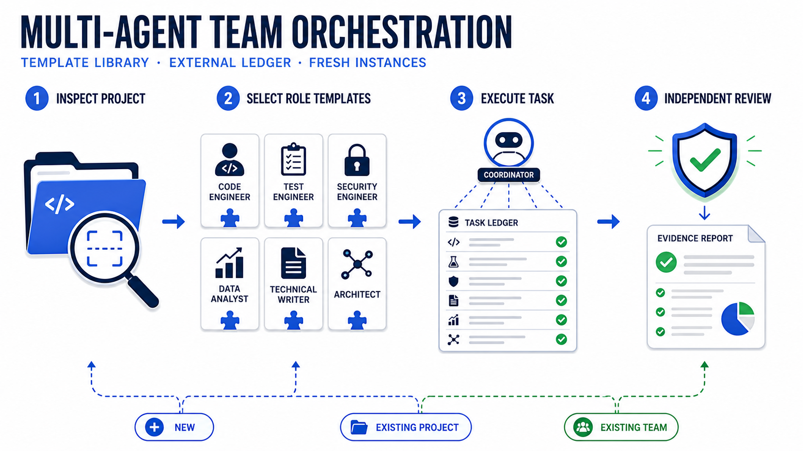
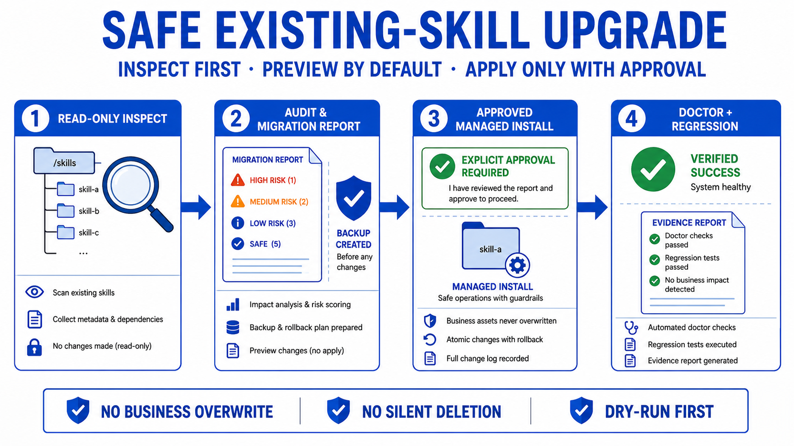

# Multi-Agent Team Skill — English Guide

<p align="center">
  <a href="../README.md">简体中文</a> · <a href="./README_zh-tw.md">繁體中文</a> · <strong>English</strong>
</p>

<p align="center">
  
</p>

`multi-agent-team-skill` is a reusable `SKILL.md` package for controlled AI development-team orchestration. The main task chooses direct work, disposable subagents, or durable domain tasks; durable tasks may use disposable subagents but cannot recursively create more durable tasks.

Version 1.0 adds deterministic routing and model tiers, explicit `recommend` / `controlled-auto` modes, schema-v2 runtime state, ownership and token controls, transactional v1 upgrades, health detection, and recoverable derived state.

## Why

Persistent agent threads accumulate stale assumptions, coordinators become overloaded by raw logs, and existing repositories can be damaged by generic team bootstrap scripts. This skill first inspects the project state, then routes it to a safe workflow and requires deterministic evidence before it reports success.

## Overview

| Route | Default behavior | Result |
|---|---|---|
| `new` | dry-run before installation | managed role templates, ledger and task package |
| `existing-project` | non-invasive managed installation | backup-aware collaboration layer |
| managed `existing-team:v1` | transactional dry-run upgrade | schema-v2 runtime state and backup |
| unknown `existing-team` | read-only audit | migration report and risks |
| `doctor` | read-only validation | explicit static validation state |
| `skill-health` | validates this source package | health and regression evidence |

## Features

- State-first routing with `inspect_team.py`, not directory-name guessing.
- Fresh, read-only reviewer instances that only receive acceptance criteria, final diff and test output.
- Role/model catalog for exploration, implementation, debugging, browser validation, architecture and evidence research.
- Externalized ledger, task package and summary records to keep coordinator context small.
- Default dry-run and explicit `--apply` for writes.
- Deterministic health checks plus new/existing environment regression.

## Comparison

| Approach | Safe for existing projects | Fresh review context | External state | Verified delivery |
|---|:---:|:---:|:---:|:---:|
| Multi-Agent Team Skill | yes | yes | yes | yes |
| Permanent sub-agent chats | manual | often no | often no | manual |
| Copying configs by hand | risky | no | inconsistent | no |

## Workflow



1. Inspect the target project read-only.
2. Choose the correct route and the smallest role profile.
3. Create execution instances from templates; keep artifacts in the ledger.
4. Review with a fresh read-only instance and verify through deterministic checks.

## Quick Start

### Prerequisites

- A coding environment that can load `SKILL.md` packages.
- Python 3.11+ and Bash.
- A target project path.

### Use as a Skill

```text
$multi-agent-team initialize the current project team
$multi-agent-team audit and optimize the current team
$multi-agent-team check whether the installed team is healthy
```

### Direct commands

```bash
# Inspect only; do not infer a route from the folder name.
python3 scripts/inspect_team.py --project <project-root>

# Preview first. It writes nothing by default.
python3 scripts/team_init.py --project <project-root> --profile auto

# Only after explicit approval. Defaults work on current Codex; override tiers when needed.
python3 scripts/team_init.py --project <project-root> --profile auto --apply \
  --model-fast <fast-model-id> \
  --model-standard <standard-model-id> \
  --model-advanced <advanced-model-id>

# Existing teams are audited, not overwritten.
python3 scripts/team_audit.py --project <project-root>
python3 scripts/team_doctor.py --project <project-root>
```

## How long-running tasks work

1. The main task turns a requirement into a task JSON and runs `thread_orchestrator.py plan`.
2. The scorer returns one decision below plus a fast/standard/advanced model tier.
3. Only under `controlled-auto` + `create_thread` does the main task call the client thread tool; scripts never fabricate thread ids.
4. After the client returns an id, record it with `register --apply`; report milestones with `update --summary ... --evidence ... --apply`.
5. Run `health` routinely; if derived state drifts, preview with `reconcile` before `--apply`.

| Planner decision | Main-task action |
|---|---|
| `handle_in_main` | Complete it directly in the main task |
| `use_subagents` | Use bounded one-shot subagents inside the current task |
| `recommend_thread` | Recommend only; needs explicit approval or `controlled-auto` |
| `create_thread` | Main task creates via the client, then records the id |
| `reuse_thread` | Send the task packet to the planner-returned `existing_thread_id` |
| `queue_or_reuse` | Active long-task cap reached; reuse or close out first |
| `queue_writer_capacity` | Concurrent-writer cap reached; queue or shrink the write scope |
| `blocked_ownership_conflict` | Resolve path-ownership conflicts before dispatch |

The task JSON contract (field names, scoring, required vs optional) lives in `references/runtime-orchestration.md`; a runnable file is at `examples/task-input.example.json`. Field names are authoritative — do not substitute aliases such as `domain` for `domain_key`.

The Luna/Terra/Sol mapping is the current Codex default. Subscription availability can differ, so use the three `--model-*` options when necessary. Static doctor checks consistency; a fresh explorer/reviewer runtime smoke test confirms actual entitlement.
An existing v2 team can change models through `team_upgrade.py`: preview with one or more `--model-*` options, then add `--apply`. Registered thread models are remapped transactionally and ambiguous old tiers fail closed.

## Modules

| Module | Responsibility |
|---|---|
| `scripts/` | inspect, initialize, audit, doctor and regression behavior |
| `templates/` | single source of truth for roles, configs and project documents |
| `references/` | progressive, route-specific operating rules |
| `governance/` | decisions, risks, changelog and health requirements |
| `install/` | local setup, safe sync and doctor entry points |
| `assets/` | public static visual assets only |

## Tech Stack

Python 3.11+ standard library, Bash, TOML, JSON and Markdown. The skill is intentionally dependency-light and keeps executable templates separate from presentation assets.

## Architecture



The managed install never silently deletes work, overwrites business code or closes existing tasks. Existing-team routing produces an audit first; writing starts only after explicit confirmation.

## Directory

```text
multi-agent-team-skill/
├── SKILL.md          # minimal trigger and routing entry
├── templates/        # deployable source of truth
├── scripts/          # deterministic operations and checks
├── references/       # progressive documentation
├── governance/       # decisions, risks and release evidence
├── install/          # safe local install commands
├── examples/         # requests and regression evidence
└── assets/           # public visual assets + manifest
```

## Commands

| Command | Purpose |
|---|---|
| `inspect_team.py` | detect route read-only |
| `team_init.py` | preview or apply a managed installation |
| `team_audit.py` | inspect existing team state without overwriting it |
| `team_upgrade.py` | preview or transactionally upgrade a managed v1 team |
| `team_doctor.py` | validate one installed target project |
| `thread_orchestrator.py` | plan, register, update, health-check and reconcile durable tasks |
| `health_check.py --deep` | validate this skill plus new, existing and runtime regressions |
| `verify_assets.sh .` | validate public visual assets and README references |

## Development Guide

Edit the source of truth under `templates/`, then keep scripts, references and governance records aligned. Do not place project-specific names, credentials or local absolute paths in templates. Keep the top-level `SKILL.md` short and route detailed operating rules through `references/`.

## Validation

```bash
python3 scripts/health_check.py --deep
PYTHONOPTIMIZE=1 python3 scripts/regression_check.py
bash scripts/verify_assets.sh .
```

## Project Status

- Version: `1.0.1`
- Model: main task + on-demand durable tasks + disposable subagents
- Write policy: dry-run first; `--apply` only after approval
- Release details: [CHANGELOG](../CHANGELOG.md)

## FAQ

**Do all eight roles run for every task?** No. Templates are available, but only the smallest relevant profile is instantiated.

**Can it rewrite a legacy repository?** No. Managed v1 teams only update known managed files after dry-run and backup; unknown schemas fail closed and are audited. Business code, custom config and role files stay outside the upgrade write scope.

**Why use a new reviewer?** A fresh reviewer does not inherit the implementation path or previous approval bias.

## Contributing

Read [CONTRIBUTING.md](../CONTRIBUTING.md), run all validation commands, and include the task scope, deterministic evidence and any migration impact in a pull request.

## Version

Follow semantic versioning. See [CHANGELOG.md](../CHANGELOG.md).

## Acknowledgements

The design follows Harness Engineering principles: source-of-truth templates, externalized state, fresh-context review and verification before completion claims.

## Star History

<p align="center">
  <a href="https://github.com/qierkang/multi-agent-team-skill"></a>
</p>

<p align="center">
  <a href="https://www.star-history.com/?repos=qierkang%2Fmulti-agent-team-skill&type=date">View the real growth trend on Star History</a>
</p>

The star count is returned live by GitHub, and the trend link targets this public repository without fabricated links or data.

## License

Released under the [MIT License](../LICENSE).

## Author

- xyqierkang@gmail.com
- https://github.com/qierkang
